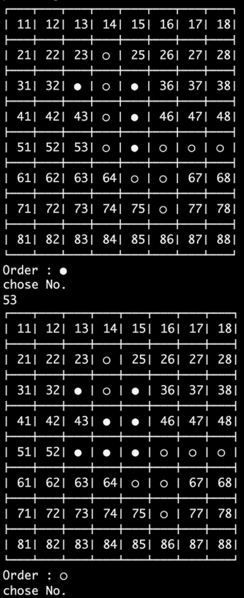
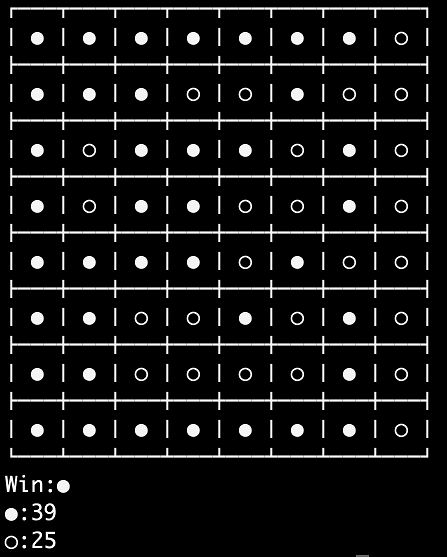

# othello-c
Othello Game made by C language programing

---
You can play othello with CUI.

### Game start screen

---

### Progress screen
Put to No.53 and reverse No.44 and No.54 

---

### Game results screen

---

